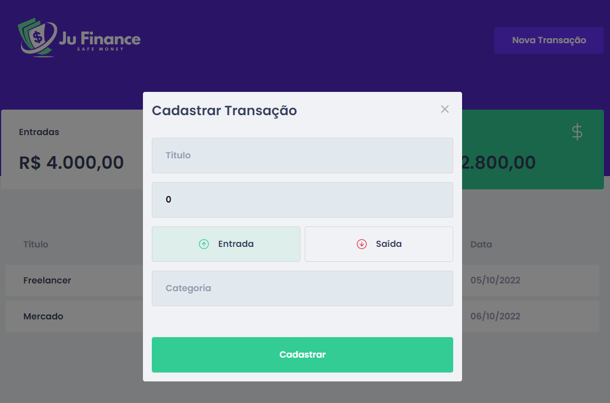

 
 
 
🚀 <b> Aplicativo para gerenciamento financeiro </b>🚀   
<i font-size: 2px>desenvolvido durante meus estudos em React</i>

## 

<h3>Layout da Aplicação WEB</h3>

   
    
  

## Tecnologias Utilizadas no Desenvolvimento
- <b>Frontend</b>
  - Styled Components, MirageJS, Context API, Hooks.
- <b> Backend </b>
  - Axios.

## Instalação das dependências e execução. 
 
  - clonar repositório
    > git clone https://github.com/juliasc12/JuFinance.git

  - yarn install
